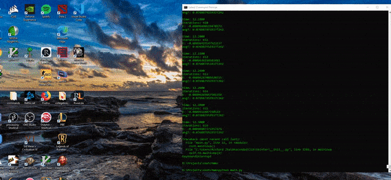

# SketchMM
SketchMM is a 2D classical molecular dynamics simulation written in python3.

---
# Theory

# TODO
# Reference
https://arxiv.org/pdf/2001.07089.pdf\
http://physics.weber.edu/schroeder/md/InteractiveMD.pdf\
http://www.courses.physics.helsinki.fi/fys/moldyn/lectures/L4.pdf\
https://web.northeastern.edu/afeiguin/p4840/p131spring04/node41.html\
https://arxiv.org/pdf/1111.2705.pdf